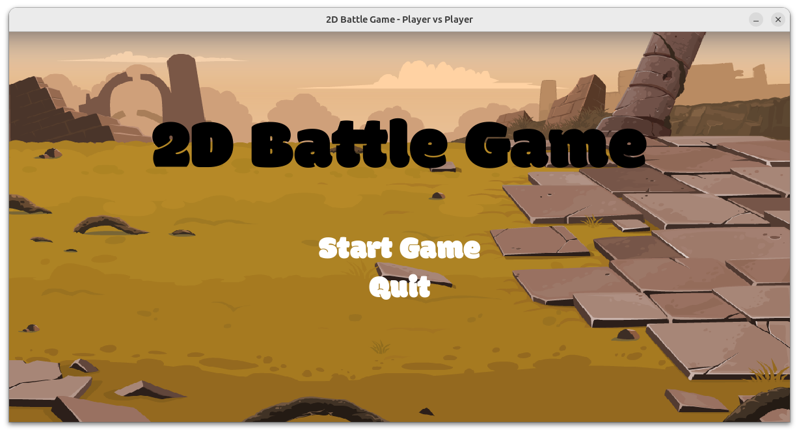

#  Group4 Project : Fighting Game



## Installation
1. pygame
2. If error happen, try running 
```bash
   export LD_PRELOAD=/usr/lib/x86_64-linux-gnu/libstdc++.so.6
   ```

## Running the Project
1. Ensure all dependencies are installed and the environment variable is set.
2. Run the main script:
```bash
   python3 mainclass.py
   ```

## Key Binding
1. ' WD 'and 'left right' : Moving 
2. ' S ' and 'down': Defend
3. ' W ' and ' up ': Jump
4. ' F ' and ' / ' : Normal Attack
5. ' G ' and ' . ' : Range  Attack
6. ' H ' and ' , ' : Skill1           (-50 energy)
7. ' J ' and ' M ' : Ultimate Skill   (-100 energy)


# Skill explanation
## Archer


### Skill 1
Step back and shoot an arrow
### Ultimate Skill
Increase range attack speed and stunned opponent but slow yourself

## Commander


### Skill 1
Teleport to your opponent and deal damage
### Ultimate Skill
Inflict your opponent with bleed effect (health drops when attacking)

## Samurai


### Skill 1
Block attack with a short time, if blocking successfully, u gain a buff
### Ultimate Skill
Increase damage, attack speed, speed 