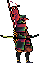

#  Group4 Project : Fighting Game


## Installation
1. pygame
2. If error happen, try running 
```bash
   export LD_PRELOAD=/usr/lib/x86_64-linux-gnu/libstdc++.so.6
   ```

## Running the Project
1. Ensure all dependencies are installed and the environment variable is set.
2. Run the main script:
```bash
   python3 mainclass.py
   ```

# Game Controls

### Movement
| Keys              | Action       |
|-------------------|--------------|
| `W` / `D`         | Move Left / Right |

### Defense
| Keys              | Action       |
|-------------------|--------------|
| `S` / `Down`      | Defend       |

### Jump
| Keys              | Action       |
|-------------------|--------------|
| `W` / `Up`        | Jump         |

### Attacks
| Keys              | Action               |
|-------------------|----------------------|
| `F` / `/`         | Normal Attack        |
| `G` / `.`         | Range Attack         |

### Skills
| Keys              | Action                 | Energy Cost |
|-------------------|------------------------|-------------|
| `H` / `,`         | Skill 1               | -50 Energy  |
| `J` / `M`         | Ultimate Skill        | -100 Energy |


# Skill Explanation

---

## Archer  


| Skill          | Description                                                                                     |
|-----------------|-----------------------------------------------------------------------------------------------|
| **Skill 1**    | Step back swiftly and shoot an arrow, creating distance while dealing ranged damage.            |
| **Ultimate**   | Increase ranged attack speed and stun the opponent, but reduce your movement speed temporarily. |

---

## Commander  


| Skill          | Description                                                                                     |
|-----------------|-----------------------------------------------------------------------------------------------|
| **Skill 1**    | Teleport directly to your opponent and deal significant damage.                                 |
| **Ultimate**   | Inflict a bleed effect on the opponent, causing their health to drop whenever they attack.      |

---

## Samurai  


| Skill          | Description                                                                                     |
|-----------------|-----------------------------------------------------------------------------------------------|
| **Skill 1**    | Block an attack within a short window. If successful, gain a temporary buff.                    |
| **Ultimate**   | Enhance your combat abilities, increasing damage, attack speed, and movement speed.             |
